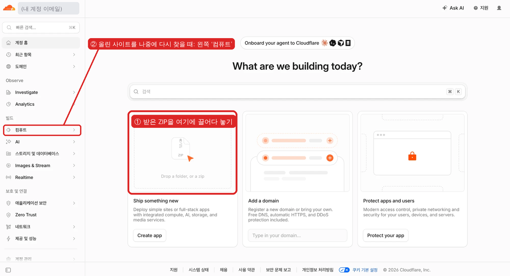

# 학생용 ZIP 사용 안내서

실습 녹화기 편집기의 **ZIP 내보내기**로 받은 `학생용-제목.zip`은 **학생용 실습 웹사이트 전체**가 들어 있는 파일입니다.
로그인·서버·데이터베이스 없이 동작하며, 학생이 누르고 입력한 내용은 학생 기기에서만 처리되고 어디에도 저장·전송되지 않습니다.

---

## 1. ZIP 안에는 무엇이 있나요?

```
학생용-제목.zip
├── index.html              ← 사이트 첫 화면(실습으로 자동 이동)
├── play/project-xxxx/      ← 실습 페이지와 실습 내용(manifest.json)
├── assets/                 ← 학생 화면 프로그램 + 가림 처리된 캡처 이미지(.webp)
├── _headers                ← 보안 설정(Cloudflare가 자동 적용)
└── README.txt              ← 이 안내의 요약
```

- 원본 캡처(가리기 전 이미지)는 **들어 있지 않습니다.** 승인할 때 가림이 적용된 이미지만 들어갑니다.
- ZIP을 **더블클릭해서 열면 동작하지 않습니다.** 브라우저 보안 때문에 반드시 웹서버(인터넷 주소)로 열어야 합니다.

---

## 2. 학생에게 나눠 주기 — Cloudflare (무료, 추천)

### 처음 한 번: 계정 만들기
<https://dash.cloudflare.com/sign-up> 에서 이메일로 가입합니다(신용카드 불필요).

### 실습 올리기



1. <https://dash.cloudflare.com> 에 로그인하면 **계정 홈**("What are we building today?") 화면이 나옵니다.
2. 가운데 **Ship something new** 칸(①, 그림의 빨간 상자 — “Drop a folder, or a zip”)에 **내려받은 ZIP 파일을 그대로 끌어다 놓습니다.** 압축을 풀 필요는 없습니다.
3. 화면 안내에 따라 배포(Deploy)를 마치면 **주소가 하나 생깁니다.** 예: `https://falling-surf-db6b.내계정.workers.dev`
   - `falling-surf-db6b` 같은 이름은 Cloudflare가 무작위로 붙인 것입니다. 그대로 써도 됩니다.
4. **그 주소를 그대로 학생에게 주면 됩니다.** 주소로 들어가면 첫 화면이 실습으로 자동 이동합니다.
   (주소 뒤에 `/play/…` 같은 것을 붙일 필요가 없습니다.)

> Cloudflare 화면은 자주 바뀝니다. 위 그림과 다르면 계정 홈에서 “Drop a folder, or a zip” 또는 **Create app** 을 찾으세요.

### 올린 사이트를 다시 찾거나 지울 때
왼쪽 메뉴 **컴퓨트**(②)를 펼치면 올린 사이트(앱) 목록이 있습니다. 사이트를 눌러 주소 확인, 설정, 삭제를 할 수 있습니다.

### 실습을 고쳤을 때
- **가장 간단한 방법**: 에디터에서 다시 **ZIP 내보내기** → 계정 홈의 같은 칸(①)에 새 ZIP을 끌어다 놓기 → **새 주소**를 학생에게 알려 주기.
- **주소를 그대로 유지하고 싶다면**: ②에서 기존 사이트를 열고 새 버전을 올리는(배포하는) 메뉴를 사용하세요. 메뉴 이름은 Cloudflare 화면 변경에 따라 다를 수 있습니다.

### 실습이 여러 개일 때
실습마다 따로 올리면 실습마다 주소가 하나씩 생깁니다(예: 메일 실습 주소, 폴더 실습 주소).

## 3. 학생 접속과 수업 진행

- **주소 공유**: 칠판·클래스룸·학급 홈페이지에 주소를 올리거나, **QR 코드**를 띄웁니다.
  (크롬에서 주소를 연 뒤 주소창 오른쪽 **공유 아이콘 → QR 코드 만들기**)
- 학생은 시작 화면에서 모드를 고릅니다.

| 모드 | 이럴 때 |
|---|---|
| **안내 모드** | 처음 배우는 날. 누를 곳이 반짝이고 설명이 바로 옆에 나옵니다. |
| **연습 모드** | 복습. 스스로 찾고, 2번 틀리면 힌트, 3번 틀리면 위치를 알려 줍니다. |
| **평가 모드** | 확인 활동. 힌트 없이 끝까지 해결합니다. |

- 특정 모드로 바로 시작하게 하려면 주소 끝에 붙이세요: `?mode=guide` / `?mode=practice` / `?mode=assessment`
- 마지막 화면에 **오답 횟수·도움 사용 횟수**가 나옵니다. 이 결과는 학생 화면에만 보이고 저장·전송되지 않으므로, 필요하면 학생이 화면을 보여 주거나 학습지에 적게 하세요.
- 태블릿·크롬북도 됩니다. 더블클릭은 두 번 빠르게 탭, 오른쪽 클릭은 길게 누르기, 단축키·스크롤은 화면의 대체 버튼을 쓰면 됩니다.

---

## 4. 수업 전날 꼭 확인하기

1. **시크릿 창**(크롬 `Ctrl/⌘+Shift+N`)으로 주소를 열어 처음부터 끝까지 한 번 해 봅니다.
2. 학생이 쓸 **실제 기기**(태블릿·크롬북 등)와 **학교 와이파이**에서 열어 봅니다.
3. 이미지 속에 가리지 못한 개인정보가 없는지 다시 확인합니다.

---

## 5. 인터넷에 올리지 않고 내 PC에서만 확인하기

1. ZIP 압축을 풉니다.
2. 압축을 푼 폴더에서 터미널을 엽니다.
   - Mac: 폴더를 우클릭 → **폴더에서 새로운 터미널 열기**
   - Windows: 폴더 주소창에 `cmd` 입력 후 Enter (Python이 설치되어 있어야 합니다: <https://www.python.org/downloads/>)
3. 아래 명령을 입력합니다.
   ```
   python3 -m http.server 8080
   ```
   (Windows에서 안 되면 `python -m http.server 8080`)
4. 브라우저에서 <http://localhost:8080> 을 엽니다. 끝낼 때는 터미널에서 `Ctrl+C`.

같은 교실 와이파이에 연결된 학생에게 이 PC 주소(예: `http://192.168.0.10:8080`)로 보여 줄 수도 있지만, 학교 네트워크 정책에 따라 막힐 수 있으니 Cloudflare에 올리는 방법을 권장합니다.

---

## 6. 꼭 지켜 주세요

- Cloudflare 주소(`…workers.dev` 등)는 **링크만 알면 누구나 볼 수 있는 공개 사이트**입니다. 실제 학생 이름·계정·연락처가 보이는 화면은 올리지 마세요. 검색에 나오지 않게(`noindex`) 설정되어 있지만, 비공개라는 뜻은 아닙니다.
- 실습 속 입력칸에는 **실제 이름·비밀번호를 넣지 말라**고 학생에게 안내하세요(화면 위쪽에도 항상 표시됩니다).
- 올린 실습을 내리려면: Cloudflare 왼쪽 메뉴 **컴퓨트** → 해당 사이트 → 설정에서 삭제.

---

## 자주 묻는 질문

**Q. ZIP을 더블클릭했더니 빈 화면만 나와요.**
A. 정상입니다. 웹서버로 열어야 합니다. 2번(Cloudflare) 또는 5번(내 PC) 방법을 쓰세요.

**Q. "실습 파일을 불러오지 못했습니다"가 나와요.**
A. ZIP 안의 폴더 구조를 바꾸지 말고 그대로 올려야 합니다. 압축을 풀었다면 `index.html`이 들어 있는 폴더 **안의 내용 전체**를 올리세요.

**Q. 에디터가 알려 준 `…/play/project-…/` 주소는 뭔가요?**
A. 사이트 안의 실습 페이지 위치입니다. 학생에게는 Cloudflare가 준 주소(예: `https://…workers.dev`)만 주면 되고, 첫 화면이 자동으로 그 페이지로 이동합니다.

**Q. 주소가 `workers.dev`로 끝나요. `pages.dev`가 아니어도 되나요?**
A. 네. 둘 다 Cloudflare의 무료 정적 사이트 주소이며 똑같이 동작합니다.

**Q. 학교 홈페이지(LMS) 안에 넣고 싶어요.**
A. 기본 보안 설정이 다른 사이트 안에 끼워 넣기(iframe)를 막습니다. 주소 링크나 QR로 공유하세요. 꼭 필요하면 개발 담당자에게 `_headers` 파일의 `frame-ancestors`에 학교 사이트 주소만 추가해 달라고 요청하세요.
