# 실습 녹화기 사용 설명서

**선생님이 프로그램을 조작하는 모습을 녹화하면, 학생이 똑같이 눌러 보며 연습하는 ‘모의 실습’ 웹페이지를 만들어 주는 프로그램**입니다.
학생은 로그인이나 설치 없이 주소 하나로 실습하고, 누르거나 입력한 내용은 학생 기기에서만 처리되어 어디에도 저장·전송되지 않습니다.

> **① 녹화** → **② 검수**(개인정보 가리고 승인) → **③ 단계 편집**(지시문·힌트) → **④ 안전 확인·학생용 ZIP** → **⑤ Cloudflare에 올려 주소 받기** → **⑥ 학생이 주소로 실습**

---

## 목차

1. [어떤 도구를 쓸까요?](#1-어떤-도구를-쓸까요)
2. [설치하기](#2-설치하기)
3. [녹화하기](#3-녹화하기)
4. [검수함 — 개인정보 가리고 승인하기](#4-검수함--개인정보-가리고-승인하기)
5. [단계 편집하기](#5-단계-편집하기)
6. [프로젝트 저장·열기](#6-프로젝트-저장열기)
7. [안전 확인과 학생용 ZIP 내보내기](#7-안전-확인과-학생용-zip-내보내기)
8. [학생에게 나눠 주기 (Cloudflare)](#8-학생에게-나눠-주기-cloudflare)
9. [학생 화면과 수업 진행](#9-학생-화면과-수업-진행)
10. [수업 전 점검표](#10-수업-전-점검표)
11. [문제 해결 · 자주 묻는 질문](#11-문제-해결--자주-묻는-질문)
12. [개인정보 보호 원칙](#12-개인정보-보호-원칙)

---

## 1. 어떤 도구를 쓸까요?

| 가르칠 내용 | 쓸 도구 |
|---|---|
| 웹사이트 사용법, 사이트 가입하기, 온라인 서비스 | **크롬 확장 프로그램** — 입력칸·비밀번호 칸을 자동으로 알아보고, 이메일·전화번호 같은 개인정보 후보를 미리 가려 줍니다. |
| 윈도우·맥 사용법, 파일 탐색기, 브라우저 자체(탭·주소창·설정), 한글·엑셀, 유니티 등 **모든 프로그램** | **데스크톱 앱** (Windows / macOS) — 화면 전체나 원하는 영역을 녹화합니다. |

두 도구 모두 **같은 편집기**가 들어 있고, 결과물(학생용 ZIP)도 같습니다.

---

## 2. 설치하기

설치 파일은 이 폴더의 `2_설치파일`에 있거나, 그곳의 `데스크톱앱_받는곳.md`에 적힌 곳에서 받습니다.

### 2-1. 데스크톱 앱 — Windows

1. `실습녹화기-설치-x.y.z.exe`를 실행합니다.
2. **“Windows의 PC 보호”** 창이 뜨면 **추가 정보 → 실행**을 누릅니다. (유료 인증서 없이 배포해서 나오는 경고입니다.)
3. 설치가 끝나면 바탕화면의 **실습 녹화기**를 실행합니다.

### 2-2. 데스크톱 앱 — Mac

1. Apple Silicon(M1 이후) 맥은 `…mac-arm64.dmg`, 인텔 맥은 `…mac-x64.dmg`를 엽니다.
   (확인: 화면 왼쪽 위 사과 메뉴 → 이 Mac에 관하여 → ‘칩’이 Apple M…이면 arm64)
2. **실습 녹화기를 ‘응용 프로그램’ 폴더로 끌어다 놓고, 그곳에서 실행**하세요. DMG 창에서 바로 실행하면 화면 기록 권한이 유지되지 않습니다. (앱이 옮기기를 제안합니다.)
3. “확인되지 않은 개발자” 경고가 뜨면 앱을 **우클릭 → 열기**. 그래도 열리지 않으면 터미널에서
   `xattr -cr "/Applications/실습 녹화기.app"`
4. 처음 녹화할 때 macOS가 **화면 기록**과 **손쉬운 사용** 권한을 묻습니다.
   macOS 창의 **‘시스템 설정 열기’**를 눌러 목록에서 **실습 녹화기**를 켠 뒤, 앱을 **종료(⌘Q)했다가 다시 실행**하세요.
5. 새 버전을 설치한 뒤 설정에 켜져 있는데도 권한 안내가 계속 뜨면, 안내 창의 **‘권한 다시 설정’**을 누르세요. 예전 권한 기록을 지우고 앱이 다시 시작됩니다. 이어서 녹화를 시작해 권한을 다시 허용하면 됩니다.

> 예전 이름(**WalkSim**)으로 설치한 앱이 있으면 지워도 됩니다. 새 앱을 처음 실행하면 저장해 둔 프로젝트가 그대로 보입니다(같은 PC·같은 사용자 기준).

### 2-3. 크롬 확장 프로그램

1. `실습녹화기-크롬확장.zip`의 압축을 풉니다. (풀린 폴더는 지우지 말고 그대로 두세요.)
2. 크롬 주소창에 `chrome://extensions` 입력 → 오른쪽 위 **개발자 모드** 켜기
3. **압축해제된 확장 프로그램 로드** → 압축을 푼 폴더 선택
4. 주소창 오른쪽 퍼즐 조각 아이콘에서 **실습 녹화기**를 고정(📌)해 두면 편합니다.

---

## 3. 녹화하기

### 녹화 전 준비 (공통)

- **더미 계정과 가상 자료**로 화면을 준비하세요. 실제 학생 명단·계정·연락처가 보이면 안 됩니다.
- 메신저·메일 알림이 뜨지 않게 **방해 금지 모드**를 켜 두세요.
- 녹화하면서 **학생이 할 동작을 한 번에 하나씩, 천천히** 합니다. 동작마다 한 장면(단계)이 됩니다.

### 3-1. 크롬 확장으로 녹화

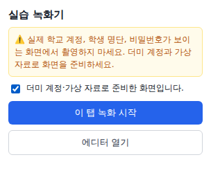

1. 녹화할 웹페이지를 엽니다.

   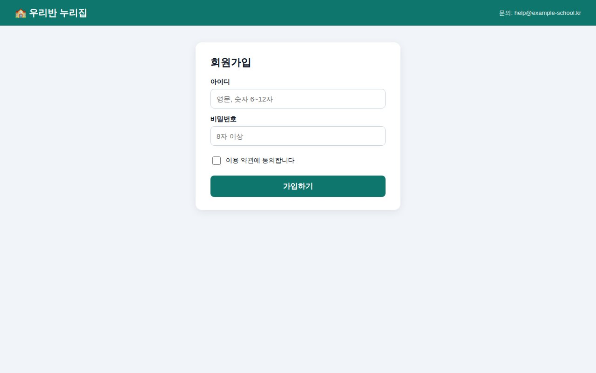

2. 주소창 오른쪽의 **실습 녹화기** 아이콘 → **“더미 계정·가상 자료로 준비한 화면입니다”** 체크 → **이 탭 녹화 시작**
3. 편집기 탭이 열립니다. 녹화하던 탭으로 돌아가 평소처럼 조작합니다.
4. 다 끝나면 아이콘 → **녹화 중지**. 마지막 화면이 ‘종료 화면’으로 들어갑니다.

### 3-2. 데스크톱 앱으로 녹화

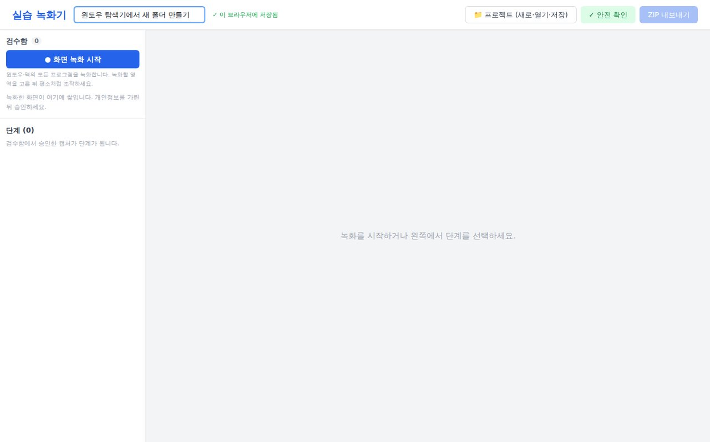

1. 왼쪽 위 **● 화면 녹화 시작**을 누릅니다.
2. 화면이 어두워지면 **녹화할 영역을 마우스로 드래그**합니다. 작업표시줄·시작 메뉴까지 가르칠 때는 **전체 화면 녹화**를 누르세요.
   모니터가 여러 대이면 모든 모니터에 선택 화면이 뜹니다. 녹화할 모니터에서 고르세요.

   

3. 화면 위쪽에 작은 **도구 막대**가 뜹니다. 이 막대는 녹화에 찍히지 않습니다.

   

4. 평소처럼 프로그램을 조작하고, 끝나면 **중지**를 누릅니다.
   - 단축키: `Ctrl+Shift+F8`(맥은 `⌘+Shift+F8`) 일시정지 / `Ctrl+Shift+F9`(맥은 `⌘+Shift+F9`) 중지

### 녹화되는 동작

| 동작 | 학생이 할 일 |
|---|---|
| 클릭 | 표시된 곳을 클릭 |
| 더블클릭 | 표시된 곳을 더블클릭 (태블릿: 두 번 빠르게 탭) |
| 오른쪽 클릭 | 마우스 오른쪽 버튼 클릭 (태블릿: 길게 누르기) |
| 끌어서 놓기 | 파란 영역을 잡아 초록 영역에 놓기 |
| 글자 입력 | 입력칸에 글자 입력 — **선생님이 입력한 내용은 기록하지 않습니다** |
| 비밀번호 입력 | ‘연습용 비밀번호 채우기’ 버튼으로 대신 채움 |
| 단축키 | 예: `Ctrl+S` — Ctrl과 맥의 ⌘는 같은 키로 인정 |
| 스크롤 | 영역 위에서 휠 굴리기 / 손가락으로 밀기 |

클릭하기 **직전의 화면**이 장면으로 저장됩니다. 그래서 학생은 “누르기 전 화면”을 보고 누를 곳을 찾습니다.

---

## 4. 검수함 — 개인정보 가리고 승인하기

녹화한 장면은 먼저 왼쪽 **검수함**에 쌓입니다. 아직 실습에 들어간 것이 아닙니다.

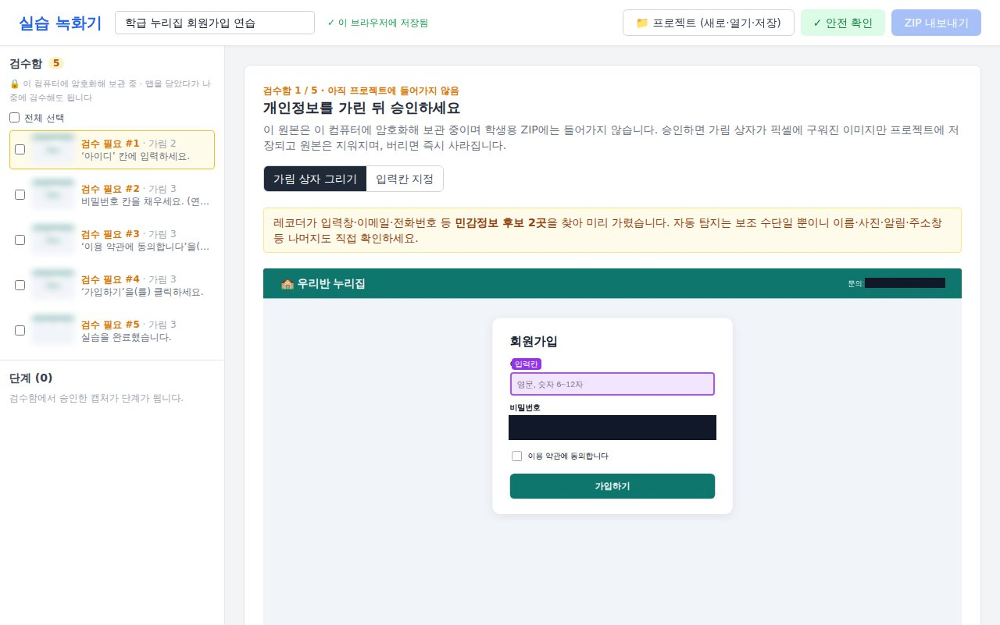

1. 장면을 하나 누르면 오른쪽에 크게 보입니다.
2. 녹화기가 이메일·전화번호·입력된 값 등 **개인정보 후보를 미리 검은 상자로 가려** 둡니다. 자동 탐지는 보조 수단일 뿐이니 **이름·사진·알림·주소창** 등 나머지도 직접 확인하세요.
   - **가림 상자 그리기**: 가릴 곳을 드래그합니다. 잘못 그린 상자는 마우스를 올리고 × 를 누르면 지워집니다.
   - **클릭 영역 / 입력칸 지정**: 학생이 눌러야 할 곳이 어긋났으면 다시 드래그합니다.
3. **지시사항 초안**(학생에게 보일 말풍선)을 확인합니다. 나중에 단계 편집에서 고쳐도 됩니다.
4. **“이미지 전체를 확인했고…”** 체크 → **가림 적용 후 단계로 추가**. 필요 없는 장면은 **버리기**.

### 여러 장 한꺼번에 처리

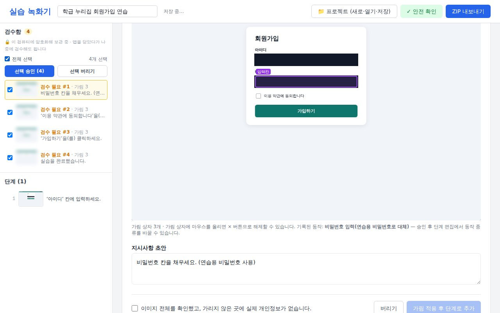

- 장면 왼쪽 체크박스나 **전체 선택**으로 고른 뒤 **선택 승인 (n)** 또는 **선택 버리기**를 누릅니다.
- 일괄 승인은 **녹화한 순서대로** 단계가 붙습니다. 누르기 전에 이미지들을 모두 확인했는지 한 번 더 묻습니다.

### 나중에 검수해도 됩니다

- 검수 전 장면은 **이 컴퓨터에 암호화해서 보관**됩니다. 앱이나 창을 닫았다가 다음에 열어도 그대로 남아 있습니다.
- 승인하면 가림이 **픽셀에 새겨진 이미지만** 프로젝트에 저장되고 원본은 지워집니다. 버리면 바로 지워집니다.

---

## 5. 단계 편집하기

승인한 장면은 왼쪽 **단계** 목록에 번호대로 쌓입니다. 단계를 누르면 편집 화면이 열립니다.

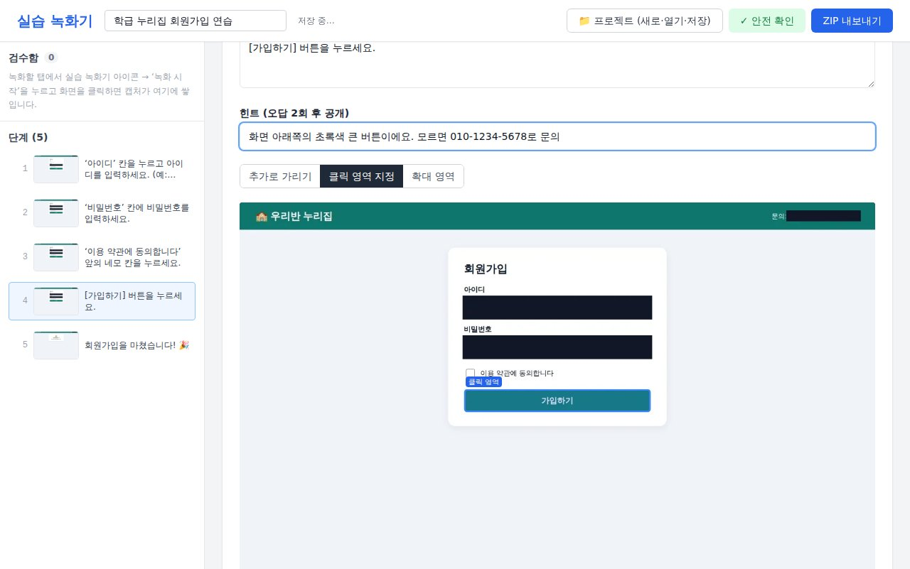

| 항목 | 설명 |
|---|---|
| **동작 종류** | 클릭·더블클릭·오른쪽 클릭·끌어서 놓기·글자 입력·단축키·스크롤·선택지(분기)·종료 화면 중에서 바꿀 수 있습니다. |
| **지시사항** | 학생에게 보이는 말풍선입니다. “[가입하기] 버튼을 누르세요.”처럼 **무엇을 어디서** 하는지 짧게 씁니다. |
| **힌트** | 연습 모드에서 **두 번 틀리면** 보입니다. 위치를 알려 주는 말로 씁니다. |
| **클릭 영역 지정** | 학생이 눌러야 할 곳을 다시 드래그합니다. |
| **추가로 가리기** | 승인한 뒤에도 가릴 곳을 더 그릴 수 있습니다. |
| **확대 영역** | 작은 버튼을 확대해서 보여 줄 부분을 드래그합니다. |
| **단계 삭제** | 필요 없는 단계를 지웁니다. |

### 글자 입력 단계

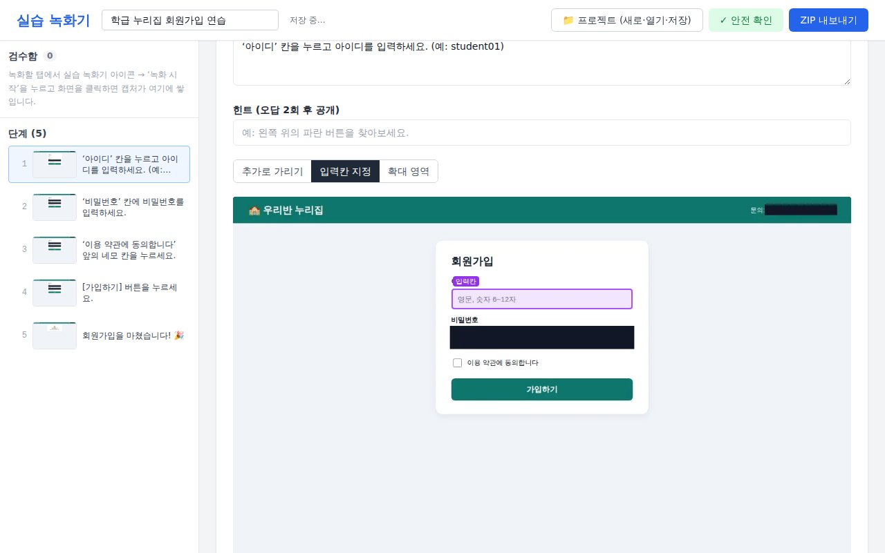

- **정답 값**을 적어 두면 그 값만 통과합니다(예: `student01`). 비워 두면 아무 값이나 통과합니다.
- 비밀번호 칸은 자동으로 **‘연습용 비밀번호 칸’**이 되어, 학생이 실제 비밀번호를 치지 않고 버튼으로 채웁니다.

---

## 6. 프로젝트 저장·열기

작업 내용은 **이 컴퓨터에 자동 저장**됩니다(제목 옆 “✓ … 저장됨” 표시). 상단 **📁 프로젝트 (새로·열기·저장)**을 누르면:

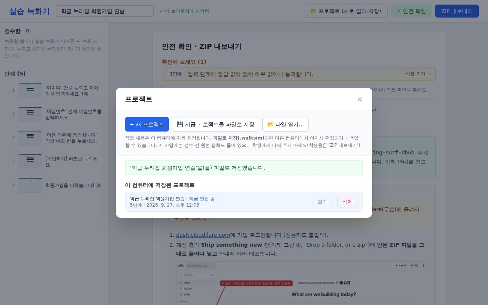

| 버튼 | 하는 일 |
|---|---|
| **+ 새 프로젝트** | 빈 프로젝트를 시작합니다. 지금 프로젝트는 목록에 그대로 남습니다. |
| **열기 / 삭제** | 이 컴퓨터에 저장된 다른 프로젝트를 엽니다 / 지웁니다. |
| **💾 지금 프로젝트를 파일로 저장** | `제목-날짜.walksim` 파일로 저장합니다. 백업하거나 **다른 컴퓨터에서 이어서 편집**할 때 씁니다. |
| **📂 파일 열기…** | `.walksim` 파일을 엽니다(새 복사본으로 열립니다). |

> ⚠️ `.walksim` 파일에는 **검수 전 원본 캡처도 들어 있을 수 있으니** 학생에게 나눠 주지 마세요. 학생에게 주는 것은 다음 장의 **학생용 ZIP**입니다.

---

## 7. 안전 확인과 학생용 ZIP 내보내기

상단 **✓ 안전 확인**(또는 **ZIP 내보내기**)을 누르면 자동 검사를 합니다.

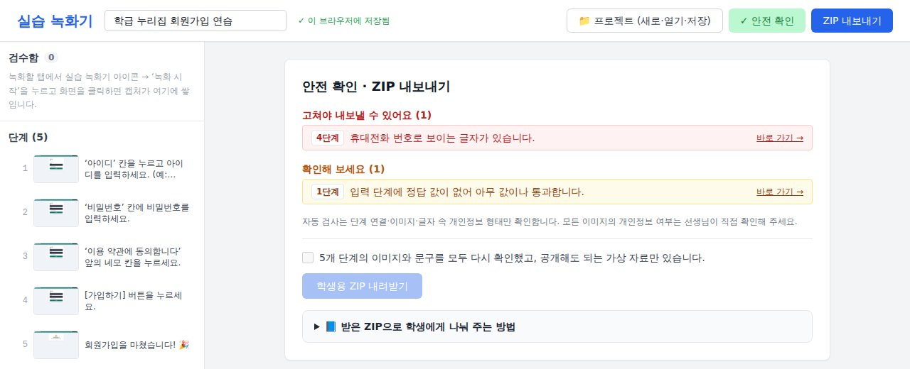

- **빨간 항목(고쳐야 내보낼 수 있어요)**: 지시문·힌트 속 전화번호·이메일처럼 보이는 글자, 이미지가 없는 단계, 검수함에 남은 장면 등.
- **노란 항목(확인해 보세요)**: 꼭 고칠 필요는 없지만 살펴볼 것.
- 항목 앞의 **“4단계”** 같은 번호가 문제 장면입니다. 항목을 누르면(**바로 가기 →**) **그 단계 편집 화면으로 바로 이동**합니다. 고친 뒤 다시 **✓ 안전 확인**을 누르세요.

빨간 항목이 없으면:

1. **“n개 단계의 이미지와 문구를 모두 다시 확인했고…”** 체크
2. **학생용 ZIP 내려받기** → `학생용-제목.zip` 파일이 내려받아집니다.

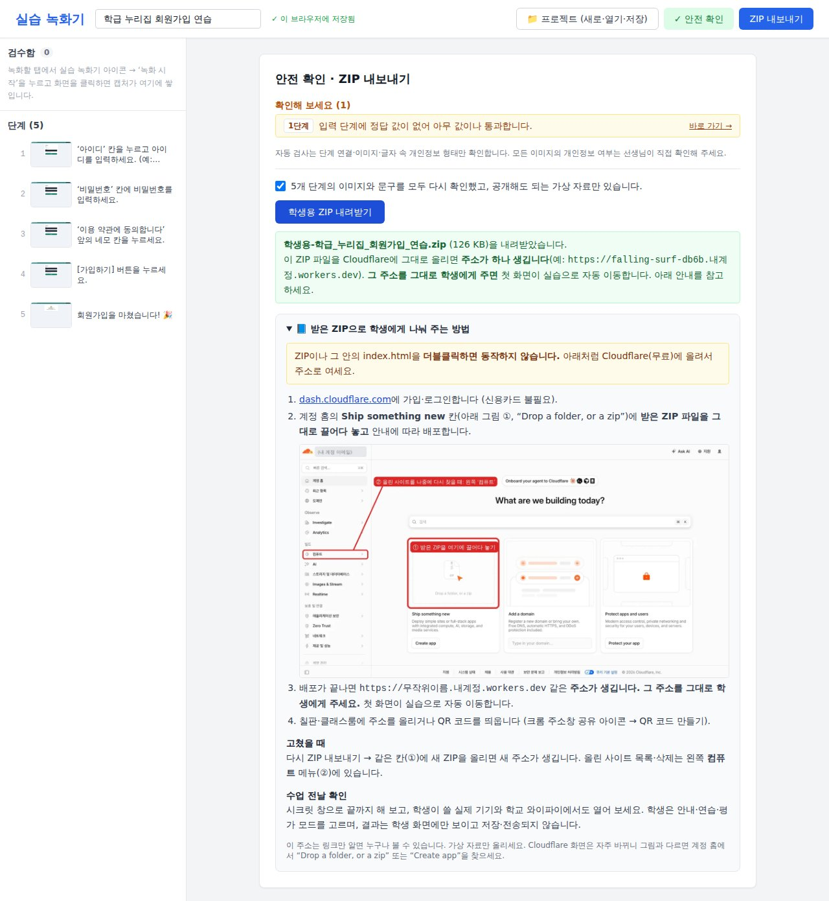

ZIP 안에는 학생용 실습 웹사이트 전체가 들어 있습니다. **가림이 적용된 이미지만** 들어가고 원본은 들어가지 않습니다.
ZIP을 더블클릭해서는 실습이 열리지 않습니다. 다음 장처럼 인터넷에 올려서 주소로 엽니다.

---

## 8. 학생에게 나눠 주기 (Cloudflare)

Cloudflare는 무료 정적 웹사이트 호스팅입니다. 신용카드가 필요 없습니다.

### 처음 한 번: 가입
<https://dash.cloudflare.com/sign-up> 에서 이메일로 가입합니다.

### 실습 올리기

1. <https://dash.cloudflare.com> 에 로그인하면 **계정 홈**(“What are we building today?”)이 나옵니다.
2. 가운데 **Ship something new** 칸(그림 ①, “Drop a folder, or a zip”)에 **받은 ZIP 파일을 그대로 끌어다 놓습니다.** 압축을 풀 필요는 없습니다.
3. 화면 안내에 따라 배포(Deploy)를 마치면 **주소가 하나 생깁니다.**
   예: `https://falling-surf-db6b.내계정.workers.dev` — 앞부분 이름은 Cloudflare가 무작위로 붙인 것이고 그대로 써도 됩니다.
4. **그 주소를 그대로 학생에게 주세요.** 주소로 들어가면 첫 화면이 실습으로 자동 이동합니다.
   (편집기가 알려 주는 `…/play/project-…/`는 사이트 안의 실습 페이지 위치일 뿐, 학생에게는 기본 주소만 주면 됩니다.)

> Cloudflare 화면은 자주 바뀝니다. 그림과 다르면 계정 홈에서 “Drop a folder, or a zip” 또는 **Create app**을 찾으세요.

### 올린 사이트 찾기·지우기
왼쪽 메뉴 **컴퓨트**(그림 ②)에 올린 사이트(앱) 목록이 있습니다. 사이트를 눌러 주소 확인·설정·삭제를 할 수 있습니다.

### 실습을 고쳤을 때
- **가장 간단한 방법**: 편집기에서 다시 ZIP 내보내기 → 계정 홈의 같은 칸(①)에 새 ZIP을 올리기 → **새 주소**를 알려 주기.
- **주소를 유지하고 싶다면**: ②에서 기존 사이트를 열고 새 버전을 올리는(배포하는) 메뉴를 쓰세요. 메뉴 이름은 Cloudflare 화면에 따라 다를 수 있습니다.

### 인터넷에 올리지 않고 내 PC에서만 확인하기
1. ZIP 압축을 풀고, 풀린 폴더에서 터미널을 엽니다. (Mac: 폴더 우클릭 → 폴더에서 새로운 터미널 열기 / Windows: 폴더 주소창에 `cmd` 입력 후 Enter, Python 설치 필요)
2. `python3 -m http.server 8080` (Windows에서 안 되면 `python -m http.server 8080`)
3. 브라우저에서 <http://localhost:8080> 을 엽니다. 끝낼 때는 `Ctrl+C`.

---

## 9. 학생 화면과 수업 진행

### 시작 화면 — 모드 고르기

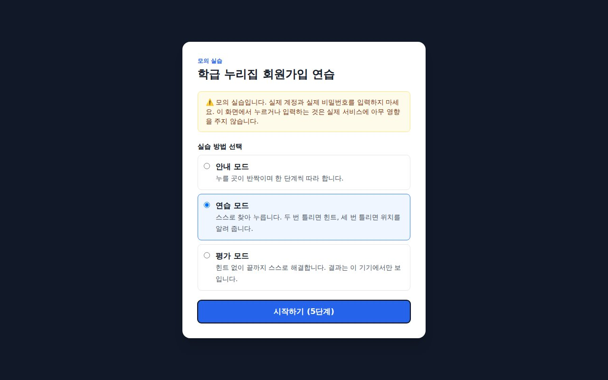

| 모드 | 이럴 때 |
|---|---|
| **안내 모드** | 처음 배우는 날. 누를 곳이 반짝이고 설명이 바로 옆에 나옵니다. |
| **연습 모드** | 복습. 스스로 찾고, 두 번 틀리면 힌트, 세 번 틀리면 위치를 알려 줍니다. |
| **평가 모드** | 확인 활동. 힌트 없이 끝까지 해결합니다. |

특정 모드로 바로 시작하게 하려면 주소 끝에 붙이세요:
`?mode=guide`(안내) / `?mode=practice`(연습) / `?mode=assessment`(평가)
예: `https://falling-surf-db6b.내계정.workers.dev/?mode=guide`

### 실습 중

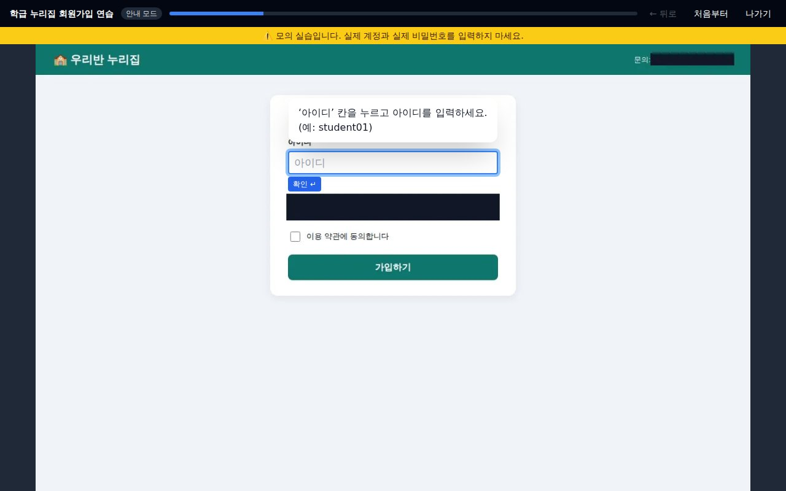

- 화면 위쪽에 항상 **“모의 실습입니다. 실제 계정과 실제 비밀번호를 입력하지 마세요.”**가 보입니다.
- 비밀번호 단계에서는 **연습용 비밀번호 채우기** 버튼을 누릅니다.

  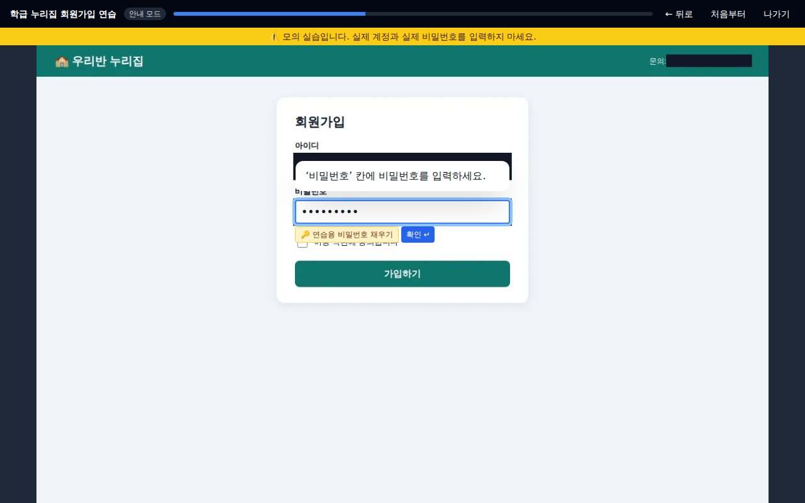

- 위쪽 막대: 진행률, **← 뒤로**, **처음부터**, **나가기**.

### 완료 화면

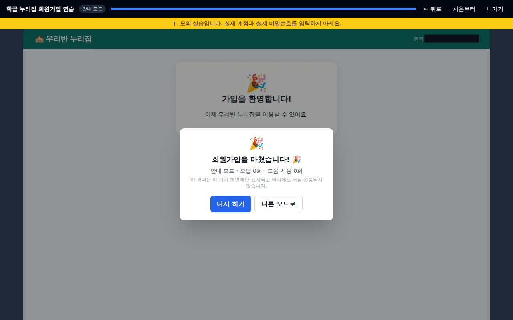

- **오답 횟수·도움 사용 횟수**가 보입니다. 이 결과는 학생 화면에만 보이고 저장·전송되지 않으므로, 필요하면 학생이 화면을 보여 주거나 학습지에 적게 하세요.
- 공유: 칠판·클래스룸에 주소를 올리거나 **QR 코드**를 띄웁니다(크롬에서 주소를 연 뒤 주소창 오른쪽 **공유 아이콘 → QR 코드 만들기**).
- 태블릿·크롬북도 됩니다. 단축키·스크롤 단계는 화면의 대체 버튼으로 할 수 있습니다.

---

## 10. 수업 전 점검표

- [ ] 모든 단계 이미지에 실제 이름·계정·연락처·알림이 보이지 않는다.
- [ ] 안전 확인에 빨간 항목이 없다.
- [ ] **시크릿 창**(크롬 `Ctrl/⌘+Shift+N`)으로 학생 주소를 열어 처음부터 끝까지 해 봤다.
- [ ] 학생이 쓸 **실제 기기**(태블릿·크롬북 등)와 **학교 와이파이**에서 열어 봤다.
- [ ] 학생에게 “실제 이름·비밀번호를 넣지 말라”고 안내했다.
- [ ] 편집한 프로젝트를 **💾 파일로 저장(.walksim)**해 백업해 두었다.

---

## 11. 문제 해결 · 자주 묻는 질문

**Q. ZIP을 더블클릭했더니 빈 화면만 나와요.**
정상입니다. 웹서버로 열어야 합니다. 8장(Cloudflare) 또는 “내 PC에서만 확인하기”를 쓰세요.

**Q. “실습 파일을 불러오지 못했습니다”가 나와요.**
ZIP 안의 폴더 구조를 바꾸지 말고 그대로 올려야 합니다. 압축을 풀었다면 `index.html`이 들어 있는 폴더 **안의 내용 전체**를 올리세요.

**Q. 주소가 `workers.dev`로 끝나요. `pages.dev`가 아니어도 되나요?**
네. 둘 다 Cloudflare의 무료 정적 사이트 주소이며 똑같이 동작합니다.

**Q. (Mac) 권한을 켰는데도 계속 권한을 달라고 해요.**
① 앱이 **응용 프로그램 폴더**에 있는지 확인 → ② 앱을 **⌘Q로 완전히 종료 후 다시 실행** → ③ 그래도 안 되면 안내 창의 **‘권한 다시 설정’**. 설정 목록에 앱이 안 보이면 목록 아래 「+」로 `응용 프로그램 → 실습 녹화기`를 추가하세요.

**Q. 녹화했는데 검수함에 장면이 안 들어와요.**
크롬 확장은 다른 사이트로 이동하면 녹화가 멈출 수 있습니다(아이콘에 안내가 뜹니다). 아이콘을 눌러 다시 시작하세요. 편집기 탭을 닫아도 다음 장면이 들어올 때 다시 열립니다. 데스크톱 앱은 **선택한 영역(모니터) 안**에서 한 동작만 기록됩니다.

**Q. 학생용 ZIP을 편집기에서 열 수 있나요?**
아니요. 학생용 ZIP에는 편집 정보가 없습니다. 이어서 편집하려면 **.walksim** 파일을 쓰세요.

**Q. 학교 홈페이지(LMS) 안에 끼워 넣고 싶어요.**
기본 보안 설정이 다른 사이트 안에 끼워 넣기(iframe)를 막습니다. 주소 링크나 QR로 공유하세요.

**Q. 예전 이름 ‘WalkSim’은 뭔가요?**
이 프로그램의 개발용 이름입니다. 프로젝트 파일 확장자(`.walksim`)와 내부 폴더 이름에 남아 있지만 사용에는 차이가 없습니다.

---

## 12. 개인정보 보호 원칙

- **원본 캡처는 선생님 컴퓨터 안에만** 있습니다(검수 전 장면은 암호화 보관). 학생용 ZIP·공개 사이트·서버로는 나가지 않습니다.
- 학생에게 가는 것은 **선생님이 가림을 확인하고 승인한 이미지뿐**입니다. 가림은 이미지 픽셀에 새겨져 되돌릴 수 없습니다.
- 녹화 중 **입력한 글자는 기록하지 않습니다.** 비밀번호 칸은 연습용 칸으로 바뀝니다.
- 학생 실습 결과는 학생 기기 화면에만 보이며 **저장·전송되지 않습니다.**
- 학생 주소는 **링크만 알면 누구나 볼 수 있는 공개 사이트**입니다(검색에는 나오지 않게 설정). **가상 자료만** 올리세요.
